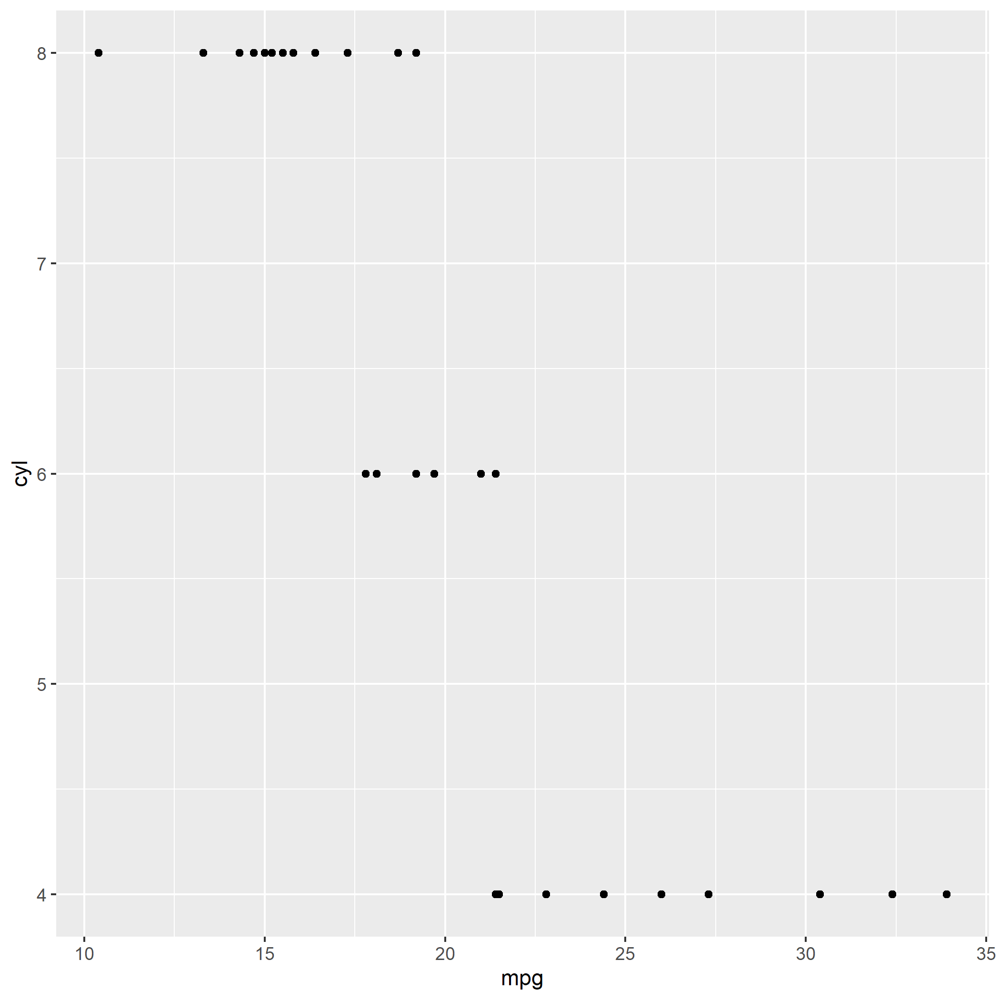

Goal of this is to is to be able to create fairly easily a gif with the progression of a plot from start of the ideation to finnish.

This is done by calling ggsave() function everytime a plot is rendered in a predefined folder, name is defined by the time when it was rendered.

Then using magick fetch all the images in the predefined folder and create a gif like this

